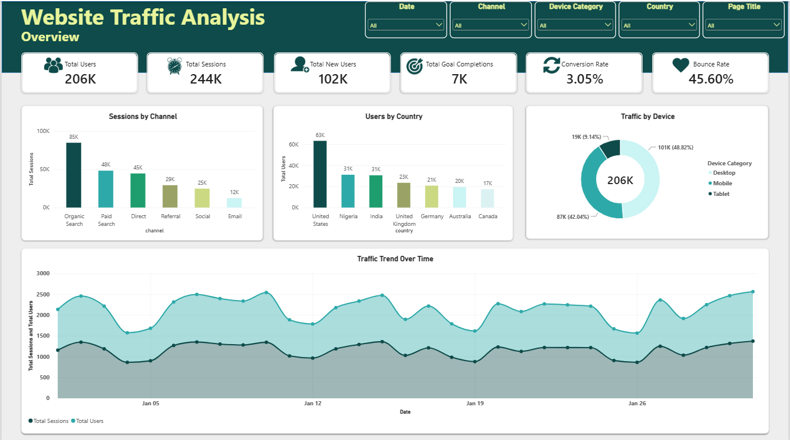
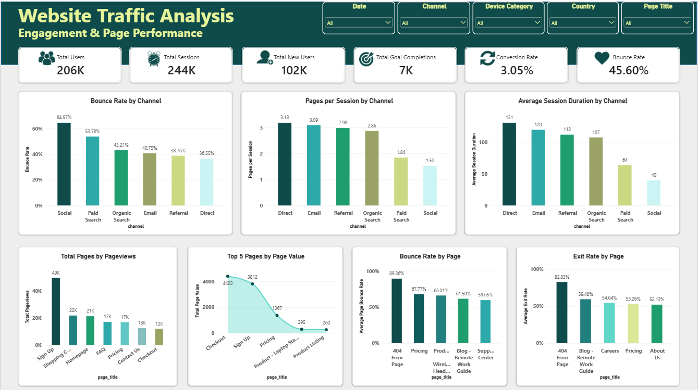

# Website Traffic Analysis | Power BI

## 📊 Project Overview

A website traffic analysis project completed as part of my **Week 2 Data Analytics Internship at Syntecxhub**.

The project focuses on analyzing website traffic, user engagement, conversion metrics, and page performance using Microsoft Power BI.

## 🛠️ Tools Used

- **Power BI** — Data visualization and dashboard development
- **Power Query** — Data cleaning and transformation
- **DAX** — KPI measures and calculations
- **Excel** — Dataset

## 📈 Key Features

- Website traffic overview and KPI cards
- Traffic analysis by channel, country, and device
- User engagement analysis
- Page performance evaluation
- Interactive slicers for filtering insights

## 📸 Dashboard Preview

### 1. Website Traffic Overview

### 2. Engagement & Page Performance

## 🎯 Project Objective

To transform website traffic data into meaningful business insights through interactive dashboards and data-driven analysis.

## 📌 Internship

**Program:** Syntecxhub Data Analytics Internship

**Task:** Week 2: Project 2

**Status:** Completed ✅

## 👩🏽‍💻 Author

**SheIsData**

Data Analyst | Power BI • SQL • Excel

---

*Learning, building, and growing through data analytics.*
